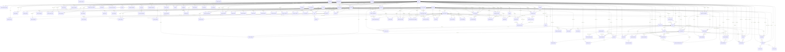

# Entity–relationship diagram

Generated from foreign keys (renders on GitHub). One line per relationship: parent `||--o{` child : foreign-key column.

```mermaid
erDiagram
    users ||--o{ account_deletion_requests : "processed_by"
    users ||--o{ account_deletion_requests : "user_id"
    auction_lots ||--o{ auction_auto_bids : "auction_lot_id"
    users ||--o{ auction_auto_bids : "user_id"
    auctions ||--o{ auction_bidders : "auction_id"
    users ||--o{ auction_bidders : "blocked_by"
    users ||--o{ auction_bidders : "user_id"
    auction_lots ||--o{ auction_bids : "auction_lot_id"
    users ||--o{ auction_bids : "user_id"
    auctions ||--o{ auction_branches : "auction_id"
    branches ||--o{ auction_branches : "branch_id"
    auctions ||--o{ auction_deposits : "auction_id"
    payments ||--o{ auction_deposits : "payment_id"
    users ||--o{ auction_deposits : "user_id"
    auction_bids ||--o{ auction_extensions : "auction_bid_id"
    auction_lots ||--o{ auction_extensions : "auction_lot_id"
    auction_lots ||--o{ auction_lot_events : "auction_lot_id"
    auctions ||--o{ auction_lots : "auction_id"
    auction_bids ||--o{ auction_lots : "current_bid_id"
    users ||--o{ auction_lots : "current_leader_id"
    auction_lots ||--o{ auction_products : "auction_lot_id"
    branches ||--o{ auction_products : "branch_id"
    products ||--o{ auction_products : "product_id"
    product_variants ||--o{ auction_products : "product_variant_id"
    auctions ||--o{ auction_translations : "auction_id"
    auction_lots ||--o{ auction_watchlists : "auction_lot_id"
    users ||--o{ auction_watchlists : "user_id"
    auction_bids ||--o{ auction_winners : "auction_bid_id"
    auction_lots ||--o{ auction_winners : "auction_lot_id"
    orders ||--o{ auction_winners : "order_id"
    users ||--o{ auction_winners : "user_id"
    users ||--o{ auctions : "created_by"
    branches ||--o{ branch_delivery_zones : "branch_id"
    delivery_zones ||--o{ branch_delivery_zones : "delivery_zone_id"
    users ||--o{ branch_employees : "assigned_by"
    branches ||--o{ branch_employees : "branch_id"
    users ||--o{ branch_employees : "user_id"
    branches ||--o{ branch_holidays : "branch_id"
    users ||--o{ branch_holidays : "created_by"
    branches ||--o{ branch_hours : "branch_id"
    branches ||--o{ branch_inventory : "branch_id"
    product_variants ||--o{ branch_inventory : "product_variant_id"
    branches ||--o{ branch_settings : "branch_id"
    carts ||--o{ cart_items : "cart_id"
    product_variants ||--o{ cart_items : "product_variant_id"
    user_addresses ||--o{ carts : "address_id"
    branches ||--o{ carts : "branch_id"
    users ||--o{ carts : "user_id"
    branches ||--o{ cash_collections : "branch_id"
    users ||--o{ cash_collections : "collected_by"
    users ||--o{ cash_collections : "handed_in_to"
    order_fulfillments ||--o{ cash_collections : "order_fulfillment_id"
    payments ||--o{ cash_collections : "payment_id"
    payment_reconciliations ||--o{ cash_collections : "payment_reconciliation_id"
    users ||--o{ catalog_imports : "user_id"
    categories ||--o{ category_translations : "category_id"
    cms_pages ||--o{ cms_page_translations : "cms_page_id"
    users ||--o{ cms_pages : "updated_by"
    coupons ||--o{ coupon_usage : "coupon_id"
    orders ||--o{ coupon_usage : "order_id"
    promotions ||--o{ coupon_usage : "promotion_id"
    users ||--o{ coupon_usage : "user_id"
    users ||--o{ coupons : "assigned_user_id"
    promotions ||--o{ coupons : "promotion_id"
    customer_groups ||--o{ customer_group_members : "customer_group_id"
    users ||--o{ customer_group_members : "user_id"
    users ||--o{ data_exports : "user_id"
    branches ||--o{ deliveries : "branch_id"
    delivery_providers ||--o{ deliveries : "delivery_provider_id"
    users ||--o{ deliveries : "driver_id"
    order_fulfillments ||--o{ deliveries : "order_fulfillment_id"
    users ||--o{ delivery_attempts : "attempted_by"
    deliveries ||--o{ delivery_attempts : "delivery_id"
    users ||--o{ delivery_proofs : "captured_by"
    deliveries ||--o{ delivery_proofs : "delivery_id"
    delivery_providers ||--o{ delivery_provider_events : "delivery_provider_id"
    delivery_slots ||--o{ delivery_slot_bookings : "delivery_slot_id"
    branches ||--o{ delivery_slots : "branch_id"
    deliveries ||--o{ delivery_status_history : "delivery_id"
    goods_receipts ||--o{ goods_receipt_items : "goods_receipt_id"
    product_variants ||--o{ goods_receipt_items : "product_variant_id"
    purchase_order_items ||--o{ goods_receipt_items : "purchase_order_item_id"
    branches ||--o{ goods_receipts : "branch_id"
    purchase_orders ||--o{ goods_receipts : "purchase_order_id"
    users ||--o{ goods_receipts : "received_by"
    homepage_sections ||--o{ homepage_section_items : "homepage_section_id"
    inventory_adjustments ||--o{ inventory_adjustment_items : "inventory_adjustment_id"
    product_variants ||--o{ inventory_adjustment_items : "product_variant_id"
    users ||--o{ inventory_adjustments : "approved_by"
    branches ||--o{ inventory_adjustments : "branch_id"
    users ||--o{ inventory_adjustments : "created_by"
    users ||--o{ loyalty_accounts : "user_id"
    loyalty_accounts ||--o{ loyalty_transactions : "loyalty_account_id"
    users ||--o{ marketing_campaigns : "created_by"
    notifications ||--o{ notification_logs : "notification_id"
    users ||--o{ notification_logs : "user_id"
    users ||--o{ notification_preferences : "user_id"
    users ||--o{ notifications : "user_id"
    users ||--o{ order_cancellations : "decided_by"
    order_fulfillments ||--o{ order_cancellations : "order_fulfillment_id"
    orders ||--o{ order_cancellations : "order_id"
    users ||--o{ order_cancellations : "requested_by"
    coupons ||--o{ order_coupons : "coupon_id"
    orders ||--o{ order_coupons : "order_id"
    promotions ||--o{ order_coupons : "promotion_id"
    users ||--o{ order_fulfillments : "assigned_to"
    branches ||--o{ order_fulfillments : "branch_id"
    delivery_slots ||--o{ order_fulfillments : "delivery_slot_id"
    delivery_zones ||--o{ order_fulfillments : "delivery_zone_id"
    orders ||--o{ order_fulfillments : "order_id"
    orders ||--o{ order_invoices : "order_id"
    branches ||--o{ order_items : "branch_id"
    order_fulfillments ||--o{ order_items : "order_fulfillment_id"
    orders ||--o{ order_items : "order_id"
    products ||--o{ order_items : "product_id"
    product_variants ||--o{ order_items : "product_variant_id"
    users ||--o{ order_notes : "author_id"
    order_fulfillments ||--o{ order_notes : "order_fulfillment_id"
    orders ||--o{ order_notes : "order_id"
    order_fulfillments ||--o{ order_status_history : "order_fulfillment_id"
    orders ||--o{ order_status_history : "order_id"
    auction_winners ||--o{ orders : "auction_winner_id"
    users ||--o{ orders : "user_id"
    cash_collections ||--o{ payment_reconciliation_items : "cash_collection_id"
    payments ||--o{ payment_reconciliation_items : "payment_id"
    payment_reconciliations ||--o{ payment_reconciliation_items : "payment_reconciliation_id"
    branches ||--o{ payment_reconciliations : "branch_id"
    users ||--o{ payment_reconciliations : "finalized_by"
    users ||--o{ payment_reconciliations : "prepared_by"
    payments ||--o{ payment_transactions : "payment_id"
    orders ||--o{ payments : "order_id"
    users ||--o{ payments : "user_id"
    branches ||--o{ pickup_reservations : "branch_id"
    delivery_slots ||--o{ pickup_reservations : "delivery_slot_id"
    users ||--o{ pickup_reservations : "handed_over_by"
    order_fulfillments ||--o{ pickup_reservations : "order_fulfillment_id"
    branches ||--o{ pickup_verifications : "branch_id"
    pickup_reservations ||--o{ pickup_verifications : "pickup_reservation_id"
    users ||--o{ pickup_verifications : "verified_by"
    product_attributes ||--o{ product_attribute_values : "product_attribute_id"
    branches ||--o{ product_branch_settings : "branch_id"
    products ||--o{ product_branch_settings : "product_id"
    users ||--o{ product_branch_settings : "updated_by"
    products ||--o{ product_images : "product_id"
    product_variants ||--o{ product_images : "product_variant_id"
    branches ||--o{ product_price_history : "branch_id"
    users ||--o{ product_price_history : "changed_by"
    products ||--o{ product_price_history : "product_id"
    product_variants ||--o{ product_price_history : "product_variant_id"
    users ||--o{ product_questions : "answered_by"
    products ||--o{ product_questions : "product_id"
    users ||--o{ product_questions : "user_id"
    products ||--o{ product_related : "product_id"
    products ||--o{ product_related : "related_product_id"
    products ||--o{ product_translations : "product_id"
    branches ||--o{ product_variant_branch_settings : "branch_id"
    product_variants ||--o{ product_variant_branch_settings : "product_variant_id"
    users ||--o{ product_variant_branch_settings : "updated_by"
    product_attribute_values ||--o{ product_variant_values : "product_attribute_value_id"
    product_variants ||--o{ product_variant_values : "product_variant_id"
    products ||--o{ product_variants : "product_id"
    products ||--o{ product_videos : "product_id"
    products ||--o{ product_warranties : "product_id"
    brands ||--o{ products : "brand_id"
    categories ||--o{ products : "category_id"
    users ||--o{ products : "created_by"
    users ||--o{ products : "updated_by"
    branches ||--o{ promotion_branches : "branch_id"
    promotions ||--o{ promotion_branches : "promotion_id"
    categories ||--o{ promotion_categories : "category_id"
    promotions ||--o{ promotion_categories : "promotion_id"
    products ||--o{ promotion_products : "product_id"
    promotions ||--o{ promotion_products : "promotion_id"
    users ||--o{ promotions : "created_by"
    customer_groups ||--o{ promotions : "customer_group_id"
    product_variants ||--o{ purchase_order_items : "product_variant_id"
    purchase_orders ||--o{ purchase_order_items : "purchase_order_id"
    users ||--o{ purchase_orders : "approved_by"
    branches ||--o{ purchase_orders : "branch_id"
    users ||--o{ purchase_orders : "created_by"
    suppliers ||--o{ purchase_orders : "supplier_id"
    users ||--o{ referrals : "referee_id"
    users ||--o{ referrals : "referrer_id"
    users ||--o{ refunds : "approved_by"
    orders ||--o{ refunds : "order_id"
    payments ||--o{ refunds : "payment_id"
    users ||--o{ refunds : "processed_by"
    users ||--o{ refunds : "requested_by"
    branches ||--o{ return_requests : "branch_id"
    users ||--o{ return_requests : "decided_by"
    orders ||--o{ return_requests : "order_id"
    refunds ||--o{ return_requests : "refund_id"
    users ||--o{ return_requests : "user_id"
    reviews ||--o{ review_media : "review_id"
    reviews ||--o{ review_reports : "review_id"
    users ||--o{ review_reports : "user_id"
    users ||--o{ reviews : "moderated_by"
    order_items ||--o{ reviews : "order_item_id"
    products ||--o{ reviews : "product_id"
    users ||--o{ reviews : "user_id"
    permissions ||--o{ role_permissions : "permission_id"
    roles ||--o{ role_permissions : "role_id"
    branches ||--o{ stock_alerts : "branch_id"
    product_variants ||--o{ stock_alerts : "product_variant_id"
    users ||--o{ stock_alerts : "user_id"
    branches ||--o{ stock_movements : "branch_id"
    product_variants ||--o{ stock_movements : "product_variant_id"
    branches ||--o{ stock_reservations : "branch_id"
    product_variants ||--o{ stock_reservations : "product_variant_id"
    product_variants ||--o{ stock_transfer_items : "product_variant_id"
    stock_transfers ||--o{ stock_transfer_items : "stock_transfer_id"
    users ||--o{ stock_transfers : "approved_by"
    branches ||--o{ stock_transfers : "destination_branch_id"
    users ||--o{ stock_transfers : "dispatched_by"
    users ||--o{ stock_transfers : "received_by"
    users ||--o{ stock_transfers : "requested_by"
    branches ||--o{ stock_transfers : "source_branch_id"
    users ||--o{ stocktaking_items : "counted_by"
    product_variants ||--o{ stocktaking_items : "product_variant_id"
    stocktaking_sessions ||--o{ stocktaking_items : "stocktaking_session_id"
    users ||--o{ stocktaking_sessions : "approved_by"
    branches ||--o{ stocktaking_sessions : "branch_id"
    categories ||--o{ stocktaking_sessions : "category_id"
    users ||--o{ stocktaking_sessions : "started_by"
    users ||--o{ support_messages : "author_id"
    support_tickets ||--o{ support_messages : "support_ticket_id"
    users ||--o{ support_tickets : "assigned_to"
    branches ||--o{ support_tickets : "branch_id"
    orders ||--o{ support_tickets : "order_id"
    users ||--o{ support_tickets : "user_id"
    users ||--o{ system_settings : "updated_by"
    delivery_zones ||--o{ user_addresses : "delivery_zone_id"
    users ||--o{ user_addresses : "user_id"
    users ||--o{ user_devices : "user_id"
    users ||--o{ user_roles : "assigned_by"
    branches ||--o{ user_roles : "branch_id"
    roles ||--o{ user_roles : "role_id"
    users ||--o{ user_roles : "user_id"
    users ||--o{ user_sessions : "user_id"
    products ||--o{ wishlist_items : "product_id"
    product_variants ||--o{ wishlist_items : "product_variant_id"
    wishlists ||--o{ wishlist_items : "wishlist_id"
    users ||--o{ wishlists : "user_id"
```
